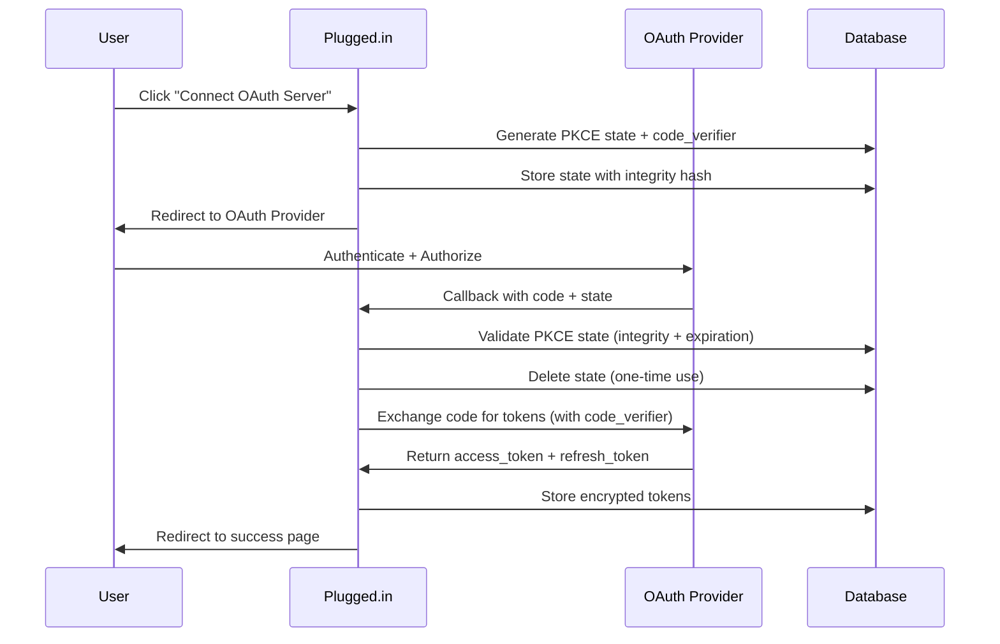

# OAuth API Reference

OAuth 2.1 authentication endpoints for MCP server authorization.

<Info>
  All OAuth endpoints are **internal** and used by the Plugged.in application. External API users should use API key authentication instead.
</Info>

## Base URL

```
Production: https://app.plugged.in
Development: http://localhost:12005
```

## Endpoints

### Initiate OAuth Flow

```http
POST /api/oauth/initiate
```

Initiates OAuth 2.1 authorization flow with PKCE.

<ParamField body="serverUuid" type="string" required>
  UUID of the MCP server to authorize
</ParamField>

<ParamField body="redirectUri" type="string" default="/api/oauth/callback">
  OAuth callback URI (usually default)
</ParamField>

**Request Example:**

```bash
curl -X POST https://app.plugged.in/api/oauth/initiate \
  -H "Content-Type: application/json" \
  -H "Cookie: session_token=..." \
  -d '{
    "serverUuid": "550e8400-e29b-41d4-a716-446655440000"
  }'
```

**Response:**

```json
{
  "authorizationUrl": "https://auth.example.com/authorize?client_id=...&code_challenge=...&state=...",
  "state": "pkce_state_abc123",
  "expiresAt": "2024-01-15T10:35:00Z"
}
```

**Status Codes:**

| Code | Description |
|------|-------------|
| 200 | Authorization URL generated successfully |
| 400 | Invalid server UUID or missing parameters |
| 401 | User not authenticated |
| 404 | Server not found or no OAuth configuration |
| 500 | OAuth discovery or configuration error |

**Security Features:**

- ✅ PKCE code_challenge generated (S256 method)
- ✅ State parameter bound to user session
- ✅ HMAC integrity hash for state validation
- ✅ 5-minute expiration on PKCE state

---

### OAuth Callback

```http
GET /api/oauth/callback
```

Handles OAuth provider callback with authorization code.

<ParamField query="code" type="string" required>
  Authorization code from OAuth provider
</ParamField>

<ParamField query="state" type="string" required>
  PKCE state parameter (generated during initiation)
</ParamField>

<ParamField query="error" type="string">
  OAuth error code (if authorization failed)
</ParamField>

<ParamField query="error_description" type="string">
  Human-readable error description
</ParamField>

**Success Response:**

Redirects to:
```
/mcp-servers?oauth_success=true&server_uuid=550e8400-e29b-41d4-a716-446655440000
```

**Error Response:**

Redirects to:
```
/mcp-servers?oauth_error=<error_code>&server_uuid=<uuid>
```

**Error Codes:**

| Code | Description | User Action |
|------|-------------|-------------|
| `state_expired` | PKCE state expired (>5 minutes) | Retry OAuth flow |
| `state_invalid` | Invalid or missing state parameter | Retry OAuth flow |
| `integrity_violation` | State tampering detected | Contact support (security issue) |
| `code_exchange_failed` | Token exchange with provider failed | Check OAuth server status |
| `user_mismatch` | Code injection attempt detected | Immediate security alert |
| `access_denied` | User denied authorization | Normal - user cancelled |

**Security Validations:**

1. ✅ PKCE state exists and not expired
2. ✅ HMAC integrity hash verification
3. ✅ User ID binding check (prevents code injection)
4. ✅ One-time use enforcement (state deleted after use)
5. ✅ Rate limiting (10 requests per 15 minutes per user)

**OAuth 2.1 Compliance:**

- ✅ PKCE code_verifier validation
- ✅ State parameter integrity
- ✅ Token rotation on refresh
- ✅ Refresh token reuse detection

---

### Token Refresh (Internal)

```http
POST /api/oauth/refresh
```

<Warning>
  This endpoint is **internal only** and used automatically by the application. Manual calls are not recommended.
</Warning>

Refreshes OAuth access token using stored refresh token.

<ParamField body="serverUuid" type="string" required>
  UUID of the MCP server with expired token
</ParamField>

**Request Example:**

```bash
curl -X POST https://app.plugged.in/api/oauth/refresh \
  -H "Content-Type: application/json" \
  -H "Cookie: session_token=..." \
  -d '{
    "serverUuid": "550e8400-e29b-41d4-a716-446655440000"
  }'
```

**Response:**

```json
{
  "success": true,
  "expiresAt": "2024-01-15T11:35:00Z"
}
```

**Status Codes:**

| Code | Description |
|------|-------------|
| 200 | Token refreshed successfully |
| 400 | Invalid server UUID or no refresh token available |
| 401 | User not authenticated or not server owner |
| 403 | Server ownership violation (security) |
| 409 | Token reuse detected - all tokens revoked (security) |
| 500 | Token exchange with OAuth provider failed |

**Security Features (OAuth 2.1):**

- ✅ Optimistic locking prevents concurrent refresh
- ✅ Refresh token marked as used before exchange
- ✅ Automatic token rotation
- ✅ Reuse detection → immediate revocation
- ✅ Server ownership validation (multi-level)

**Race Condition Prevention:**

The endpoint uses atomic database operations:

```typescript
// 1. Atomic lock acquisition
UPDATE mcp_server_oauth_tokens
SET refresh_token_locked_at = NOW()
WHERE server_uuid = $1
RETURNING *;

// 2. Check if already used (reuse detection)
IF refresh_token_used_at IS NOT NULL:
  REVOKE ALL TOKENS  // Security measure
  RETURN 403

// 3. Exchange with OAuth provider
// 4. Store new tokens atomically
```

---

### PKCE Cleanup (Internal Cron)

```http
POST /api/oauth/cleanup-pkce
```

<Warning>
  This endpoint requires `CRON_SECRET` authentication and should only be called by external cron services.
</Warning>

Manually triggers expired PKCE state cleanup.

<ParamField header="Authorization" type="string" required>
  Bearer token with `CRON_SECRET` value
</ParamField>

**Request Example:**

```bash
curl -X POST https://app.plugged.in/api/oauth/cleanup-pkce \
  -H "Authorization: Bearer $CRON_SECRET"
```

**Response:**

```json
{
  "deleted": 15,
  "gracePeriodMinutes": 10
}
```

**Automatic Cleanup:**

The application automatically runs cleanup every **15 minutes** with a **10-minute grace period**:

```typescript
// Automatic cleanup (no manual call needed)
setInterval(() => {
  cleanupExpiredPkceStates(); // Every 15 minutes
}, 15 * 60 * 1000);
```

**Grace Period Logic:**

States are only deleted if they expired **more than 10 minutes ago**:

```typescript
// Cutoff time: 10 minutes ago
const cutoffTime = new Date(Date.now() - 10 * 60 * 1000);

// Only delete states that expired BEFORE cutoff
DELETE FROM oauth_pkce_states
WHERE expires_at < cutoffTime;
```

This protects OAuth flows that may still be completing even after the 5-minute PKCE expiration.

---

## Metrics Endpoint

```http
GET /metrics
```

<Info>
  Public endpoint exposing Prometheus metrics for monitoring
</Info>

Returns OAuth metrics in Prometheus format.

**Response Example:**

```text
# HELP oauth_flows_total Total number of OAuth flows
# TYPE oauth_flows_total counter
oauth_flows_total{provider="github-mcp-server",status="success"} 42
oauth_flows_total{provider="github-mcp-server",status="failure"} 2

# HELP oauth_token_refresh_total Token refresh attempts
# TYPE oauth_token_refresh_total counter
oauth_token_refresh_total{status="success",reason="normal"} 128
oauth_token_refresh_total{status="reuse_detected",reason="security"} 0

# HELP oauth_active_tokens Current active OAuth tokens
# TYPE oauth_active_tokens gauge
oauth_active_tokens 15

# HELP oauth_code_injection_attempts_total Code injection attempts
# TYPE oauth_code_injection_attempts_total counter
oauth_code_injection_attempts_total 0
```

**Available Metrics:**

<AccordionGroup>
  <Accordion title="Flow Metrics">
    - `oauth_flows_total{provider, status}` - Total flows by outcome
    - `oauth_flow_duration_seconds{provider, status}` - Flow duration histogram
  </Accordion>

  <Accordion title="Token Metrics">
    - `oauth_token_refresh_total{status, reason}` - Refresh attempts
    - `oauth_token_refresh_duration_seconds{status}` - Refresh duration
    - `oauth_token_revocations_total{reason}` - Token revocations
    - `oauth_active_tokens` - Current active token count
  </Accordion>

  <Accordion title="PKCE Metrics">
    - `oauth_pkce_validations_total{status, reason}` - PKCE validations
    - `oauth_pkce_states_created_total` - States created
    - `oauth_pkce_states_cleaned_total{reason}` - States cleaned up
    - `oauth_active_pkce_states` - Current active states
  </Accordion>

  <Accordion title="Security Metrics">
    - `oauth_security_events_total{event_type, severity}` - Security events
    - `oauth_integrity_violations_total{violation_type}` - Integrity violations
    - `oauth_code_injection_attempts_total` - Code injection attempts
  </Accordion>

  <Accordion title="Discovery Metrics">
    - `oauth_discovery_attempts_total{method, status}` - Discovery attempts
    - `oauth_discovery_duration_seconds{method, status}` - Discovery duration
  </Accordion>

  <Accordion title="Registration Metrics">
    - `oauth_client_registrations_total{status}` - Client registrations
    - `oauth_client_registration_duration_seconds{status}` - Registration duration
  </Accordion>
</AccordionGroup>

**Scrape Configuration:**

```yaml
# Prometheus configuration
scrape_configs:
  - job_name: 'pluggedin-app'
    static_configs:
      - targets: ['localhost:12005']
    metrics_path: '/metrics'
    scrape_interval: 15s
```

---

## OAuth Flow Diagram



---

## Security Features Summary

<CardGroup cols={2}>
  <Card title="PKCE (RFC 7636)" icon="lock">
    - S256 challenge method
    - 256-bit code verifier
    - One-time state validation
    - 5-minute expiration
  </Card>

  <Card title="State Integrity" icon="shield-check">
    - HMAC-SHA256 binding
    - User ID validation
    - Server UUID binding
    - Tampering detection
  </Card>

  <Card title="Token Rotation" icon="rotate">
    - Single-use refresh tokens
    - Automatic rotation
    - Reuse detection
    - Immediate revocation
  </Card>

  <Card title="Ownership Validation" icon="user-check">
    - Server → Profile → Project → User chain
    - Multi-level verification
    - Prevents token substitution
    - Cross-user attack prevention
  </Card>
</CardGroup>

---

## Error Handling

### Client-Side Error Handling

```typescript
// Handle OAuth callback errors
const searchParams = new URLSearchParams(window.location.search);

if (searchParams.has('oauth_error')) {
  const errorCode = searchParams.get('oauth_error');
  const serverUuid = searchParams.get('server_uuid');

  switch (errorCode) {
    case 'state_expired':
      showNotification('OAuth session expired. Please try again.');
      break;
    case 'access_denied':
      showNotification('Authorization cancelled.');
      break;
    case 'integrity_violation':
      showError('Security error detected. Please contact support.');
      break;
    default:
      showError(`OAuth failed: ${errorCode}`);
  }
}
```

### Server-Side Error Handling

All OAuth endpoints return structured errors:

```json
{
  "error": "state_expired",
  "message": "PKCE state expired after 5 minutes",
  "details": {
    "state": "pkce_state_abc123",
    "expiredAt": "2024-01-15T10:30:00Z",
    "currentTime": "2024-01-15T10:37:00Z"
  }
}
```

---

## Rate Limiting

OAuth endpoints are protected by rate limiting:

| Endpoint | Limit | Window |
|----------|-------|--------|
| `/api/oauth/initiate` | 10 requests | 15 minutes per user |
| `/api/oauth/callback` | 10 requests | 15 minutes per user |
| `/api/oauth/refresh` | 60 requests | 1 minute per user |
| `/api/oauth/cleanup-pkce` | 1 request | 1 minute (cron only) |

**Rate Limit Headers:**

```http
X-RateLimit-Limit: 10
X-RateLimit-Remaining: 7
X-RateLimit-Reset: 1705320000
```

**Rate Limit Exceeded Response:**

```json
{
  "error": "rate_limit_exceeded",
  "message": "Too many OAuth requests. Please try again later.",
  "retryAfter": 300
}
```

---

## Testing OAuth Endpoints

### Development Environment

```bash
# Set up test OAuth provider
export OAUTH_TEST_CLIENT_ID=test-client-id
export OAUTH_TEST_CLIENT_SECRET=test-client-secret
export OAUTH_TEST_AUTH_URL=https://auth.example.com/authorize
export OAUTH_TEST_TOKEN_URL=https://auth.example.com/token

# Start application
pnpm dev

# Test OAuth flow
curl -X POST http://localhost:12005/api/oauth/initiate \
  -H "Content-Type: application/json" \
  -H "Cookie: session_token=..." \
  -d '{"serverUuid": "test-server-uuid"}'
```

### Integration Tests

```typescript
import { describe, it, expect } from 'vitest';

describe('OAuth API', () => {
  it('should initiate OAuth flow with PKCE', async () => {
    const response = await fetch('/api/oauth/initiate', {
      method: 'POST',
      headers: { 'Content-Type': 'application/json' },
      body: JSON.stringify({ serverUuid: 'test-uuid' }),
    });

    const data = await response.json();

    expect(data.authorizationUrl).toContain('code_challenge');
    expect(data.authorizationUrl).toContain('code_challenge_method=S256');
    expect(data.state).toBeDefined();
  });

  it('should reject expired PKCE state', async () => {
    // Wait 6 minutes
    await sleep(6 * 60 * 1000);

    const response = await fetch(
      `/api/oauth/callback?code=test&state=expired-state`
    );

    expect(response.url).toContain('oauth_error=state_expired');
  });
});
```

---

## Best Practices

<Card title="Security Checklist" icon="shield-halved">
  - ✅ Always use HTTPS in production
  - ✅ Never log sensitive tokens or code verifiers
  - ✅ Monitor `oauth_code_injection_attempts_total` metric
  - ✅ Set up alerts for `oauth_token_reuse_detected`
  - ✅ Rotate `NEXTAUTH_SECRET` periodically
  - ✅ Review OAuth security logs weekly
  - ✅ Keep dependencies updated (npm audit)
</Card>

<Card title="Performance Tips" icon="gauge">
  - ✅ Enable HTTP/2 for faster OAuth redirects
  - ✅ Use connection pooling for database queries
  - ✅ Cache OAuth provider metadata (RFC 9728)
  - ✅ Monitor p95 latency for token refresh
  - ✅ Set appropriate PKCE cleanup interval (15 min)
</Card>

<Card title="Monitoring Best Practices" icon="chart-line">
  - ✅ Track OAuth flow success rate (SLO: >95%)
  - ✅ Monitor token refresh duration (p95 < 2s)
  - ✅ Alert on any code injection attempts
  - ✅ Review integrity violations daily
  - ✅ Analyze OAuth error distribution weekly
</Card>

---

## Related Documentation

<CardGroup cols={2}>
  <Card title="OAuth 2.1 Security" icon="shield-halved" href="/security/oauth-2.1">
    Complete OAuth security implementation
  </Card>

  <Card title="Observability" icon="chart-mixed" href="/observability/overview">
    Monitoring and logging guide
  </Card>

  <Card title="Migration Guide" icon="database" href="/deployment/oauth-migration">
    Upgrade to OAuth observability
  </Card>

  <Card title="Troubleshooting" icon="wrench" href="/troubleshooting">
    Common OAuth issues and solutions
  </Card>
</CardGroup>
