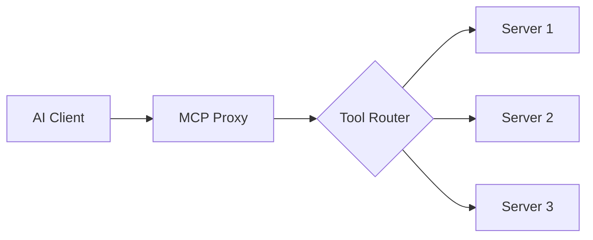

# MCP Proxy

The Plugged.in MCP Proxy is a lightweight, high-performance server that aggregates multiple Model Context Protocol (MCP) servers into a single unified interface.

## What is MCP Proxy?

<Info>
MCP Proxy acts as a gateway between AI assistants and multiple MCP servers, simplifying integration and management.
</Info>

The proxy server:
- **Aggregates** multiple MCP servers into one endpoint
- **Manages** authentication and connection pooling
- **Transforms** different transport types (STDIO, SSE, Streamable HTTP)
- **Provides** unified tool discovery and invocation
- **Handles** error recovery and retry logic

## Architecture

<CardGroup cols={2}>
  <Card title="Client Side" icon="laptop">
    - AI Assistants (Claude, GPT, etc.)
    - MCP Clients
    - API Consumers
    - Web Applications
  </Card>
  <Card title="Proxy Layer" icon="server">
    - Connection Management
    - Request Routing
    - Response Aggregation
    - Error Handling
  </Card>
  <Card title="MCP Servers" icon="cubes">
    - STDIO Servers
    - Streamable HTTP Servers
    - SSE Servers (deprecated)
    - Custom Implementations
  </Card>
  <Card title="Features" icon="sparkles">
    - Tool Discovery
    - Resource Access
    - Prompt Templates
    - OAuth Support
  </Card>
</CardGroup>

## Key Features

### 1. Multi-Transport Support

Supports all MCP transport types:

```typescript
// STDIO Transport
{
  transport: {
    type: "stdio",
    command: "node",
    args: ["server.js"]
  }
}

// Streamable HTTP Transport
{
  transport: {
    type: "streamable",
    baseUrl: "https://api.example.com/mcp"
  }
}

// SSE Transport (deprecated)
{
  transport: {
    type: "sse",
    url: "https://api.example.com/sse"
  }
}
```

### 2. Unified Tool Interface

Access tools from multiple servers through one endpoint:

```typescript
// Discover all available tools
const tools = await proxy.listTools();
// Returns tools from all connected servers

// Invoke a tool
const result = await proxy.invokeTool({
  name: "search_documents",
  parameters: { query: "MCP integration" }
});
```

### 3. Intelligent Routing

Automatically routes requests to the appropriate server:



### 4. Connection Management

- **Connection Pooling**: Reuse connections for performance
- **Health Checks**: Automatic server health monitoring
- **Retry Logic**: Automatic retry with exponential backoff
- **Circuit Breaker**: Prevent cascading failures

### 5. Authentication

Multiple authentication methods:

<Tabs>
  <Tab title="API Key">
    ```typescript
    {
      auth: {
        type: "apiKey",
        key: process.env.PLUGGEDIN_API_KEY
      }
    }
    ```
  </Tab>
  <Tab title="OAuth">
    ```typescript
    {
      auth: {
        type: "oauth",
        provider: "github",
        token: accessToken
      }
    }
    ```
  </Tab>
  <Tab title="Custom">
    ```typescript
    {
      auth: {
        type: "custom",
        headers: {
          "X-Custom-Auth": "token"
        }
      }
    }
    ```
  </Tab>
</Tabs>

## Use Cases

### 1. AI Assistant Integration

Connect multiple specialized MCP servers to your AI assistant:

```typescript
// Configure proxy with multiple servers
const proxy = new MCPProxy({
  servers: [
    { name: "github", url: "mcp://github.com/servers/github" },
    { name: "slack", url: "mcp://slack.com/servers/slack" },
    { name: "database", url: "mcp://internal/database" }
  ]
});

// AI assistant can now access all tools
const response = await assistant.query(
  "Search GitHub issues and post summary to Slack"
);
```

### 2. Enterprise Integration

Aggregate internal and external MCP servers:

```typescript
// Internal servers behind firewall
const internalServers = [
  { name: "crm", url: "mcp://internal.company.com/crm" },
  { name: "erp", url: "mcp://internal.company.com/erp" }
];

// External SaaS integrations
const externalServers = [
  { name: "salesforce", url: "mcp://salesforce.com/api" },
  { name: "hubspot", url: "mcp://hubspot.com/api" }
];

// Unified access through proxy
const proxy = new MCPProxy({
  servers: [...internalServers, ...externalServers]
});
```

### 3. Development Workflow

Simplify development with local and remote servers:

```typescript
// Local development server
const localServer = {
  name: "dev",
  transport: {
    type: "stdio",
    command: "npm",
    args: ["run", "mcp:dev"]
  }
};

// Production servers
const prodServers = [
  { name: "api", url: "https://api.production.com/mcp" },
  { name: "data", url: "https://data.production.com/mcp" }
];

// Switch between environments easily
const proxy = new MCPProxy({
  servers: isDev ? [localServer] : prodServers
});
```

## Performance

### Optimization Strategies

<AccordionGroup>
  <Accordion title="Connection Pooling">
    Maintains persistent connections to frequently used servers:
    ```typescript
    {
      connectionPool: {
        maxConnections: 10,
        idleTimeout: 60000,
        keepAlive: true
      }
    }
    ```
  </Accordion>

  <Accordion title="Response Caching">
    Caches tool discovery and resource listings:
    ```typescript
    {
      cache: {
        ttl: 300000, // 5 minutes
        maxSize: 100 // MB
      }
    }
    ```
  </Accordion>

  <Accordion title="Parallel Execution">
    Execute requests to multiple servers in parallel:
    ```typescript
    const results = await Promise.all([
      proxy.invokeTool({ server: "s1", name: "tool1" }),
      proxy.invokeTool({ server: "s2", name: "tool2" })
    ]);
    ```
  </Accordion>

  <Accordion title="Lightweight Design">
    Minimal dependencies for Docker deployment:
    - Core size: < 50MB
    - Memory usage: < 128MB
    - Startup time: < 2 seconds
  </Accordion>
</AccordionGroup>

## Security

### Built-in Security Features

<Warning>
Always use authentication and encryption in production environments.
</Warning>

1. **Authentication**: Required for all production deployments
2. **Rate Limiting**: Prevent abuse and DoS attacks
3. **Input Validation**: Sanitize all inputs before forwarding
4. **Audit Logging**: Track all tool invocations
5. **Encryption**: TLS/SSL for all network communication

### Security Configuration

```typescript
{
  security: {
    authentication: {
      required: true,
      type: "apiKey"
    },
    rateLimiting: {
      enabled: true,
      requests: 100,
      window: 60000 // 1 minute
    },
    cors: {
      enabled: true,
      origins: ["https://trusted.domain.com"]
    },
    audit: {
      enabled: true,
      level: "info"
    }
  }
}
```

## Monitoring

### Health Checks

The proxy provides health endpoints:

```bash
# Overall health
GET /health
{
  "status": "healthy",
  "servers": {
    "connected": 5,
    "healthy": 5
  }
}

# Individual server health
GET /health/servers
{
  "servers": [
    { "name": "github", "status": "healthy", "latency": 45 },
    { "name": "slack", "status": "healthy", "latency": 120 }
  ]
}
```

### Metrics

Track proxy performance:

```typescript
// Prometheus metrics endpoint
GET /metrics

# HELP mcp_proxy_requests_total Total requests
# TYPE mcp_proxy_requests_total counter
mcp_proxy_requests_total{method="listTools"} 1234

# HELP mcp_proxy_latency_seconds Request latency
# TYPE mcp_proxy_latency_seconds histogram
mcp_proxy_latency_seconds_bucket{le="0.1"} 900
```

## Comparison

### MCP Proxy vs Direct Connection

| Feature | MCP Proxy | Direct Connection |
|---------|-----------|-------------------|
| Multiple Servers | ✅ Unified access | ❌ Separate connections |
| Authentication | ✅ Centralized | ❌ Per-server config |
| Connection Management | ✅ Pooling & reuse | ❌ Manual handling |
| Error Recovery | ✅ Automatic retry | ❌ Manual implementation |
| Tool Discovery | ✅ Aggregated | ❌ Per-server query |
| Performance | ✅ Optimized | ⚠️ Depends on implementation |
| Monitoring | ✅ Built-in | ❌ Custom implementation |

## Getting Started

<Steps>
  <Step title="Install">
    Install the MCP Proxy package
    [Installation Guide](/mcp-proxy/installation)
  </Step>
  <Step title="Configure">
    Set up your servers and authentication
    [Configuration Guide](/mcp-proxy/installation#configuration)
  </Step>
  <Step title="Connect">
    Connect your AI clients to the proxy
    [Integration Guide](/mcp-proxy/installation#integration)
  </Step>
  <Step title="Monitor">
    Set up monitoring and alerts
    [Monitoring Guide](/mcp-proxy/installation#monitoring)
  </Step>
</Steps>

## Next Steps

- [Installation Guide](/mcp-proxy/installation) - Set up MCP Proxy
- [Changelog](/mcp-proxy/changelog) - See what's new
- [API Reference](/api/reference) - Detailed API documentation
- [GitHub Repository](https://github.com/VeriTeknik/pluggedin-mcp) - Source code