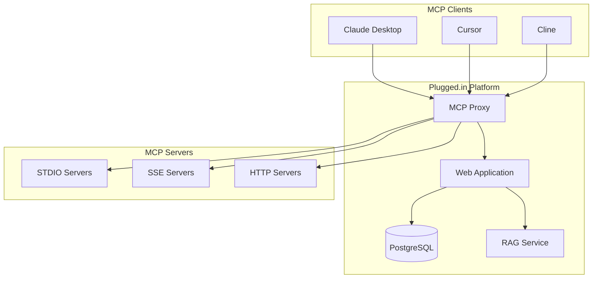

# Platform Overview

Plugged.in is the crossroads for AI data exchanges - a comprehensive platform for managing Model Context Protocol (MCP) servers with integrated RAG (Retrieval-Augmented Generation) capabilities.

## What is Plugged.in?

Plugged.in provides a unified interface for discovering, configuring, and utilizing AI tools across multiple MCP servers while leveraging your own documents as context. It works seamlessly with any MCP client (Claude, Cline, Cursor, etc.) while providing advanced management capabilities through an intuitive web interface.

<CardGroup cols={2}>
  <Card title="Cloud Platform" icon="cloud" href="https://plugged.in">
    Fully managed, zero-configuration platform with automatic updates
  </Card>
  <Card title="Self-Hosted" icon="server" href="/quickstart/installation">
    Run your own instance with complete control over your data
  </Card>
</CardGroup>

## Core Capabilities

### 🎯 MCP Registry Integration (v2.7.0+)

<AccordionGroup>
  <Accordion title="Registry Features">
    - Modified fork of the official MCP Registry
    - Claim MCP servers with GitHub credentials
    - Enhanced server detection and management
    - Full Streamable HTTP support
    - OAuth authentication handled by Plugged.in
    - Trending servers with analytics
  </Accordion>

  <Accordion title="Smart Server Wizard">
    - Multi-step wizard with GitHub verification
    - Automatic environment detection
    - Registry submission with progress tracking
    - Package type detection (npm, Docker, PyPI)
  </Accordion>

  <Accordion title="Server Discovery">
    - Search across GitHub, Smithery, and npmjs.com
    - Filter by package type and repository source
    - Sort by relevance, recency, or popularity
    - Rich metadata including ratings and installations
  </Accordion>
</AccordionGroup>

### 🚀 Multi-Workspace Support

Organize your MCP servers into separate workspaces to prevent context pollution:

- **Projects**: Top-level organization units
- **Profiles**: Multiple workspaces per project
- **Isolation**: Each profile has its own MCP server configurations
- **Quick Switching**: Seamlessly switch between different contexts

### 🤖 AI Document Exchange (RAG v2)

<Tabs>
  <Tab title="Document Management">
    - Upload documents in various formats (PDF, text, images, code)
    - AI-generated documents with full attribution
    - Document versioning and change tracking
    - Multi-source support (uploads, AI, API)
  </Tab>

  <Tab title="Document Viewer">
    - Native PDF rendering with page navigation
    - Image viewer with zoom controls (10%-500%)
    - Syntax highlighting for 20+ code formats
    - Markdown rendering for documentation
    - Fullscreen mode for immersive viewing
  </Tab>

  <Tab title="Search & Discovery">
    - Semantic search using PostgreSQL full-text search
    - Filter by AI model, date, tags, and source
    - Relevance scoring and snippet generation
    - Project-isolated document querying
  </Tab>
</Tabs>

### 🔐 Security & Encryption

<Warning>
All sensitive data is protected with enterprise-grade security measures.
</Warning>

- **End-to-End Encryption**: AES-256-GCM encryption for sensitive data
- **Per-Profile Isolation**: Each profile has its own encryption key
- **Secure Sharing**: Sanitized templates without credentials
- **SSRF Prevention**: Comprehensive URL validation
- **Rate Limiting**: Tiered limits for different operations

### 🛡️ Sandboxing & Isolation

<Info>
All STDIO MCP servers run in secure sandboxed environments by default.
</Info>

- **Bubblewrap Sandboxing**: User-namespace based isolation (primary)
- **Firejail Support**: SUID-based sandboxing (fallback)
- **Resource Limits**: CPU, memory, and I/O constraints
- **Filesystem Isolation**: Restricted access to system files
- **Network Control**: Optional network isolation for untrusted servers
- **Process Containment**: Prevents escape from sandbox environment

### 🔔 Notification System

Real-time activity tracking with optional email delivery:

- MCP server activity logs
- Custom notifications via `pluggedin_send_notification` tool
- Email integration for critical alerts
- Non-blocking asynchronous processing

## Platform Architecture



## Key Features by Version

### v2.10.0 - Security & Performance
- Comprehensive security audit
- Performance optimizations
- Custom Instructions UI
- Enhanced error handling
- Encryption system overhaul

### v2.8.0 - AI Document Exchange
- AI-generated documents with attribution
- Enhanced document viewer
- Model attribution tracking
- Advanced search capabilities
- Document versioning

### v2.7.0 - Registry v2
- MCP Registry integration
- OAuth authentication
- Smart Server Wizard
- Trending servers
- Bidirectional notifications

### v2.2.0 - Encryption
- End-to-end encryption
- Per-profile isolation
- Secure server sharing
- Transparent operation

### v2.1.0 - RAG & Notifications
- Document library with RAG
- Real-time notifications
- Progressive server initialization
- Enhanced security
- Improved UI/UX

## Supported MCP Transports

<CardGroup cols={3}>
  <Card title="STDIO" icon="terminal">
    Standard input/output for local processes
  </Card>
  <Card title="SSE" icon="stream">
    Server-sent events for real-time streaming
  </Card>
  <Card title="HTTP" icon="globe">
    Streamable HTTP for web-based servers
  </Card>
</CardGroup>

## Integration Options

### For Developers

<Tabs>
  <Tab title="API Access">
    ```bash
    # Search for MCP servers
    GET /api/search?q=database

    # Get server statistics
    GET /api/servers/{uuid}/stats

    # Submit to registry
    POST /api/registry/submit
    ```
  </Tab>

  <Tab title="MCP Tools">
    The platform provides these MCP tools:
    - `pluggedin_create_document`
    - `pluggedin_list_documents`
    - `pluggedin_search_documents`
    - `pluggedin_get_document`
    - `pluggedin_update_document`
    - `pluggedin_send_notification`
  </Tab>

  <Tab title="Webhooks">
    Configure webhooks for:
    - Server installation events
    - Document creation
    - User activities
    - System notifications
  </Tab>
</Tabs>

### For Organizations

- **Private Deployment**: Self-host on your infrastructure
- **Custom Branding**: White-label the platform
- **SSO Integration**: Connect with your identity provider
- **Compliance**: Meet regulatory requirements
- **Support**: Enterprise support available

## Performance & Scalability

### Resource Management

- **CPU Limits**: Configurable per-server CPU allocation
- **Memory Limits**: Control memory usage per MCP server
- **I/O Throttling**: Prevent resource exhaustion
- **Timeout Controls**: Automatic cleanup of hung processes

### Optimization Features

- **Package Caching**: Reuse common packages
- **Connection Pooling**: Efficient database connections
- **Lazy Loading**: On-demand server initialization
- **Background Processing**: Non-blocking operations

## Community & Ecosystem

<CardGroup cols={2}>
  <Card title="GitHub" icon="github" href="https://github.com/VeriTeknik/pluggedin-app">
    Star the repository and contribute
  </Card>
  <Card title="Registry" icon="book" href="https://plugged.in/search">
    Browse and share MCP servers
  </Card>
  <Card title="Discord" icon="discord" href="https://discord.gg/pluggedin">
    Join the community discussion
  </Card>
  <Card title="Documentation" icon="book-open" href="/">
    Explore guides and references
  </Card>
</CardGroup>

## Technology Stack

### Frontend
- **Framework**: Next.js 15 with App Router
- **UI Library**: React 19
- **Styling**: Tailwind CSS
- **Components**: Shadcn/UI with Radix primitives
- **State Management**: SWR for data fetching

### Backend
- **Runtime**: Node.js
- **API**: Next.js API Routes & Server Actions
- **Database**: PostgreSQL 15+ with Drizzle ORM
- **Authentication**: NextAuth.js with JWT
- **Encryption**: AES-256-GCM

### Infrastructure
- **Deployment**: Docker, Kubernetes
- **Monitoring**: Built-in telemetry
- **Caching**: In-memory and Redis support
- **CDN**: CloudFlare compatible

## Roadmap

### Coming Soon
- Advanced analytics dashboard
- Team collaboration features
- Plugin marketplace
- Mobile application
- GraphQL API

### Under Consideration
- Federated MCP servers
- Blockchain integration
- Voice interface
- AR/VR support

## Getting Started

<Steps>
  <Step title="Choose Your Setup">
    Decide between [Cloud](https://plugged.in) or [Self-hosted](/quickstart/installation)
  </Step>
  <Step title="Create Account">
    Sign up and configure your profile
  </Step>
  <Step title="Add MCP Servers">
    Browse the registry or add custom servers
  </Step>
  <Step title="Connect Clients">
    Configure Claude, Cursor, or other MCP clients
  </Step>
  <Step title="Start Building">
    Leverage AI tools in your workflows
  </Step>
</Steps>

## Support & Resources

- **Documentation**: You're here! Explore all sections
- **GitHub Issues**: [Report bugs and request features](https://github.com/VeriTeknik/pluggedin-app/issues)
- **Email Support**: support@plugged.in
- **Enterprise**: Contact sales@plugged.in

## License

Plugged.in is open-source software licensed under the MIT License. See the [GitHub repository](https://github.com/VeriTeknik/pluggedin-app) for details.