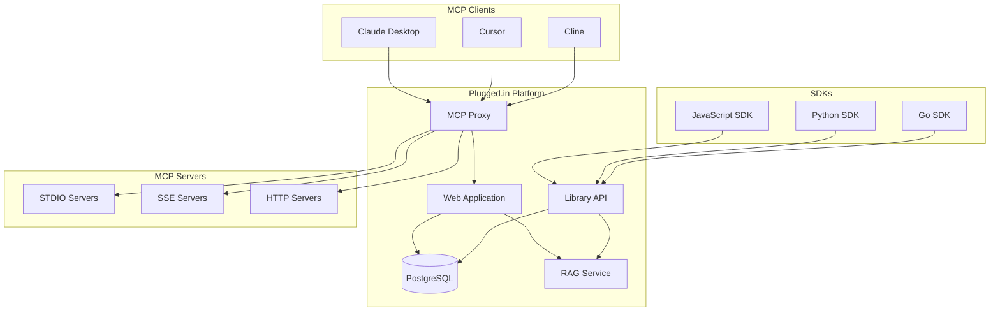

# Platform Overview

Plugged.in is the crossroads for AI data exchanges - a comprehensive platform for managing Model Context Protocol (MCP) servers with integrated RAG (Retrieval-Augmented Generation) capabilities.

## What is Plugged.in?

**Plugged.in is the unified control plane that solves fragmentation in today's AI landscape.** Every AI platform keeps its own isolated ecosystem of tools, documents, and context. Plugged.in creates one governed layer where your knowledge, tools, and memory stay with you across every AI model and platform.

<Info>
**The Problem:** Every AI model keeps its own tools, documents, and memories → fragmentation & cost.<br/>
**The Solution:** One governed layer for Memory · Knowledge · Tools across every model.
</Info>

Plugged.in provides a unified interface for discovering, configuring, and utilizing AI tools across multiple MCP servers while leveraging your own documents as context. It works seamlessly with any MCP client (Claude, Cline, Cursor, LM Studio, ChatGPT, etc.) while providing advanced management capabilities through an intuitive web interface.

<CardGroup cols={2}>
  <Card title="Cloud Platform" icon="cloud" href="https://plugged.in">
    Fully managed, zero-configuration platform with automatic updates
  </Card>
  <Card title="Self-Hosted" icon="server" href="/quickstart/installation">
    Run your own instance with complete control over your data
  </Card>
</CardGroup>

## The Three Pillars

<CardGroup cols={3}>
  <Card title="📚 Knowledge Base" icon="book-open">
    **✅ IN PRODUCTION**<br/>
    Your documents become a living, searchable knowledge base accessible to any AI. Upload once, and every model can query your PDFs, docs, and files through RAG-powered semantic search. AI models can even create and collaborate on documents directly in your library, with complete version history and model attribution.
  </Card>

  <Card title="🔧 Tools" icon="wrench">
    **✅ IN PRODUCTION**<br/>
    With 1,500+ MCP servers in the registry and automatic OAuth token management, you get one-click tool installation that works across Claude Desktop, ChatGPT, Cursor, Cline, VSCode, LM Studio, and any MCP-compatible client. Configure your tools once, use them everywhere.
  </Card>

  <Card title="🧠 Memory" icon="brain">
    **🚧 IN DEVELOPMENT**<br/>
    The missing piece is persistent context that evolves with you. Plugged.in's memory layer will provide focus-aware AI that understands your current task (Focus Agent), retains session context (Short-term Memory), and builds long-term understanding of your projects, preferences, and patterns.
  </Card>
</CardGroup>

## Core Capabilities

### 🎯 MCP Registry Integration (v2.7.0+)

<AccordionGroup>
  <Accordion title="Registry Features">
    - Modified fork of the official MCP Registry
    - Claim MCP servers with GitHub credentials
    - Enhanced server detection and management
    - Full Streamable HTTP support
    - OAuth authentication handled by Plugged.in
    - Trending servers with analytics
  </Accordion>

  <Accordion title="Smart Server Wizard">
    - Multi-step wizard with GitHub verification
    - Automatic environment detection
    - Registry submission with progress tracking
    - Package type detection (npm, Docker, PyPI)
  </Accordion>

  <Accordion title="Server Discovery">
    - Search across GitHub, Smithery, and npmjs.com
    - Filter by package type and repository source
    - Sort by relevance, recency, or popularity
    - Rich metadata including ratings and installations
  </Accordion>
</AccordionGroup>

### 🚀 Multi-Workspace Support

Organize your MCP servers into separate workspaces to prevent context pollution:

- **Projects**: Top-level organization units
- **Profiles**: Multiple workspaces per project
- **Isolation**: Each profile has its own MCP server configurations
- **Quick Switching**: Seamlessly switch between different contexts

### 🤖 AI Document Exchange (RAG v2)

<Tabs>
  <Tab title="Document Management">
    - Upload documents in various formats (PDF, text, images, code)
    - AI-generated documents with full attribution
    - Document versioning with complete history tracking
    - Multi-source support (uploads, AI, API)
    - Version comparison and rollback capabilities
  </Tab>

  <Tab title="AI Search (v2.11.1+)">
    - **Semantic Understanding**: Natural language queries with context
    - **Document Names**: Human-readable names instead of IDs
    - **Clickable Sources**: Direct navigation to source documents
    - **Smart Debounce**: 500ms delay for optimal performance
    - **Comprehensive Answers**: Synthesized from multiple documents
  </Tab>

  <Tab title="Document Viewer">
    - Native PDF rendering with page navigation
    - Image viewer with zoom controls (10%-500%)
    - Syntax highlighting for 20+ code formats
    - Markdown rendering for documentation
    - Fullscreen mode for immersive viewing
    - Version history with diff visualization
  </Tab>

  <Tab title="Search & Discovery">
    - Toggle between AI and traditional search
    - Semantic search using advanced NLP
    - Filter by AI model, date, tags, and source
    - Relevance scoring and snippet generation
    - Project-isolated document querying
  </Tab>
</Tabs>

### 🔐 Security & Encryption

<Warning>
All sensitive data is protected with enterprise-grade security measures.
</Warning>

- **End-to-End Encryption**: AES-256-GCM encryption for all sensitive data (commands, args, env vars, URLs)
- **Per-Profile Key Derivation**: Unique encryption key per workspace using SHA-256 with profile UUIDs
- **Transparent Operation**: Automatic encryption/decryption with secure key derivation
- **Secure Sharing**: Sanitized templates without exposing credentials
- **SSRF Prevention**: Comprehensive URL validation with private IP and dangerous port protection
- **Command Allowlisting**: STDIO servers restricted to safe commands (node, npx, python, python3, uv, uvx, uvenv)
- **Header Validation**: RFC 7230 compliant header sanitization with injection prevention
- **Rate Limiting**: Tiered limits with Redis-based DDoS protection and intelligent fallbacks
- **HTML Sanitization**: Industry-standard sanitization with sanitize-html
- **Input Validation**: Comprehensive Zod schemas for all API endpoints

### 🛡️ Sandboxing & Isolation

<Info>
All STDIO MCP servers run in secure sandboxed environments by default.
</Info>

- **Bubblewrap Sandboxing**: User-namespace based isolation (primary)
- **Firejail Support**: SUID-based sandboxing (fallback)
- **Resource Limits**: CPU, memory, and I/O constraints
- **Filesystem Isolation**: Restricted access to system files
- **Network Control**: Optional network isolation for untrusted servers
- **Process Containment**: Prevents escape from sandbox environment

### 🔔 Notification System

Real-time activity tracking with optional email delivery:

- **MCP Activity Tracking**: All tool calls, resource reads, and prompt executions
- **Custom Notifications**: Via `pluggedin_send_notification` tool with localization support
- **Email Integration**: Optional delivery for critical alerts with custom titles
- **Advanced Filtering**: By severity (INFO, SUCCESS, WARNING, ALERT) with search functionality
- **Sorting Options**: By newest/oldest first with instant refresh capability
- **Protected Custom Notifications**: Secure notification creation with proper validation
- **Reduced Polling**: Optimized from 60s to 15s intervals for better performance
- **Bidirectional Support**: Send and receive notifications through MCP proxy

## Platform Architecture



### 🚀 Official SDKs

<Info>
Programmatically interact with Plugged.in's Library API using our official SDKs for JavaScript, Python, and Go.
</Info>

<CardGroup cols={3}>
  <Card title="JavaScript/TypeScript" icon="js" href="/sdks/javascript">
    ```bash
    npm install pluggedinkit-js
    ```
    Full TypeScript support with async/await
  </Card>
  <Card title="Python" icon="python" href="/sdks/python">
    ```bash
    pip install pluggedinkit
    ```
    Sync & async clients with type hints
  </Card>
  <Card title="Go" icon="golang" href="/sdks/go">
    ```bash
    go get github.com/veriteknik/pluggedinkit-go
    ```
    Native Go implementation with contexts
  </Card>
</CardGroup>

#### SDK Features
- **Document Management**: Full CRUD operations with versioning
- **RAG Integration**: Query your knowledge base programmatically
- **File Uploads**: Upload documents with progress tracking
- **Type Safety**: Complete type definitions in all languages
- **Authentication**: Secure API key authentication
- **Rate Limiting**: Built-in retry logic with exponential backoff

## Key Features by Version

### v2.12.0 - Upload Context Metadata (Latest)
- **Upload Context Metadata**: Purpose, related documents, and notes tracking
- **Upload Method Detection**: Drag-drop vs file-picker identification
- **UploadMetadataPanel Component**: Rich metadata editing interface
- **Security Enhancements**: Zod validation and XSS prevention
- **Performance**: Minimal bundle impact (~1-2KB)

### v2.10.0 - Security & Performance
- Comprehensive security audit addressing all GitHub security findings
- Complete encryption system overhaul with scrypt key derivation
- Performance optimizations with 10x faster database queries
- Enhanced Content Security Policy (CSP) implementation
- Custom Instructions UI improvements
- Advanced error handling and type safety

### v2.9.0 - UUID Tool Prefixing & Security
- **Automatic UUID Tool Prefixing**: Prevents tool name collisions between MCP servers
- **Slug-based Tool Prefixing**: Profile-scoped unique server identifiers
- **Automatic Slug Generation**: From server names with collision resolution
- **Security Release**: Encryption migration from predictable to cryptographically secure random salts
- **SSL Support**: Database connections with configurable certificate validation

### v2.8.0 - AI Document Exchange (RAG v2)
- **AI Document Creation**: Direct generation via MCP tools with rich metadata
- **Multi-format Support**: Markdown, plain text, JSON, HTML with validation
- **Complete Version History**: Full tracking with attribution and change diffs
- **Model Attribution**: Shows which AI models contributed to each document
- **Enhanced Library Interface**: Source filtering tabs and metadata display
- **RAG v2 Search**: Semantic search across all documents with relevance scoring

### v2.7.0 - Registry v2 & OAuth Integration
- **Registry v2 Integration**: Modified fork of official MCP Registry with GitHub auth
- **Smart Server Wizard**: Multi-step interface with repository analysis
- **OAuth for MCP Servers**: Centralized authentication with AES-256-GCM encryption
- **Trending Servers**: Real-time activity tracking and popularity algorithms
- **Bidirectional Notifications**: Send/receive notifications via API
- **Streamable HTTP**: Complete protocol support with session management

### v2.2.0 - Encryption
- End-to-end encryption
- Per-profile isolation
- Secure server sharing
- Transparent operation

### v2.1.0 - RAG & Notifications
- Document library with RAG
- Real-time notifications
- Progressive server initialization
- Enhanced security
- Improved UI/UX

## Supported MCP Transports

<CardGroup cols={3}>
  <Card title="STDIO" icon="terminal">
    Standard input/output for local processes
  </Card>
  <Card title="SSE" icon="stream">
    Server-sent events for real-time streaming
  </Card>
  <Card title="HTTP" icon="globe">
    Streamable HTTP for web-based servers
  </Card>
</CardGroup>

## Developer Experience

### ⚡ Speed to Production

<Info>
**Developer-first design** enables rapid PoC→production transitions with one-click tools, clean playground, and comprehensive SDKs.
</Info>

<Tabs>
  <Tab title="One-Click Setup">
    ```bash
    # 1. Sign up (seconds)
    curl -X POST https://plugged.in/api/auth/register

    # 2. Add knowledge base
    curl -X POST https://plugged.in/api/documents/upload \
      -H "Authorization: Bearer $API_KEY" \
      -F "file=@docs.pdf"

    # 3. Install MCP tools (1,500+ available)
    curl -X POST https://plugged.in/api/mcp-servers \
      -H "Authorization: Bearer $API_KEY" \
      -d '{"name": "database-tools", "transport": "stdio"}'

    # 4. Connect to any AI - Done! 🚀
    ```
  </Tab>

  <Tab title="SDK Integration">
    **JavaScript/TypeScript**
    ```typescript
    import { PluggedInClient } from 'pluggedinkit-js';

    const client = new PluggedInClient({
      apiKey: process.env.PLUGGEDIN_API_KEY,
      baseUrl: 'https://plugged.in'
    });

    // Search documents
    const results = await client.documents.search({
      query: 'project architecture',
      profileUuid: 'your-profile-id'
    });

    // Create AI document
    const doc = await client.documents.createAI({
      prompt: 'Document our API design',
      format: 'markdown',
      profileUuid: 'your-profile-id'
    });
    ```

    **Python**
    ```python
    from pluggedinkit import PluggedInClient

    client = PluggedInClient(api_key="your-key")

    # Upload and search documents
    client.upload_document("docs.pdf", profile_id="profile-123")
    results = client.search_documents("API architecture", profile_id="profile-123")

    # Manage MCP servers
    servers = client.list_servers(profile_id="profile-123")
    ```

    **Go**
    ```go
    client := pluggedin.NewClient("your-api-key")

    // Search knowledge base
    results, err := client.Documents.Search(ctx, &pluggedin.SearchOptions{
      Query: "system design",
      ProfileUUID: "profile-123",
    })
    ```
  </Tab>

  <Tab title="MCP Integration">
    **7 Built-in Tools:**
    - `pluggedin_create_document` - AI document generation
    - `pluggedin_list_documents` - Browse with filtering
    - `pluggedin_search_documents` - Semantic RAG search
    - `pluggedin_get_document` - Retrieve with history
    - `pluggedin_update_document` - Version tracking
    - `pluggedin_send_notification` - Custom alerts
    - `pluggedin_discover_tools` - Registry integration
  </Tab>
</Tabs>

### Integration Options

<CardGroup cols={3}>
  <Card title="REST API" icon="globe">
    Full REST API with authentication
  </Card>
  <Card title="MCP Protocol" icon="bot">
    Native MCP server integration
  </Card>
  <Card title="SDK Libraries" icon="code">
    Official SDKs in 3 languages
  </Card>
</CardGroup>

### For Organizations

- **Private Deployment**: Self-host on your infrastructure
- **Custom Branding**: White-label the platform
- **SSO Integration**: Connect with your identity provider
- **Compliance**: Meet regulatory requirements
- **Support**: Enterprise support available

## Performance & Scalability

### Resource Management

- **CPU Limits**: Configurable per-server CPU allocation
- **Memory Limits**: Control memory usage per MCP server
- **I/O Throttling**: Prevent resource exhaustion
- **Timeout Controls**: Automatic cleanup of hung processes

### Optimization Features

- **Package Caching**: Reuse common packages
- **Connection Pooling**: Efficient database connections
- **Lazy Loading**: On-demand server initialization
- **Background Processing**: Non-blocking operations

## Competitive Advantages

<AccordionGroup>
  <Accordion title="🔗 Convergence">
    **Unique convergence of capabilities:** Agents use tools while staying grounded in project knowledge + durable memory. No other platform combines all three.
  </Accordion>

  <Accordion title="🌐 Cross-Platform & Model-Agnostic">
    **True platform independence:** Manage once, run across Claude/ChatGPT/Cursor/LM Studio + SDKs. No vendor lock-in.
  </Accordion>

  <Accordion title="🔐 Data Ownership & Governance">
    **User-centric design:** Workspaces, export capabilities, permissioning, and audit trails ensure your data stays yours.
  </Accordion>

  <Accordion title="⚡ Developer-First Speed to Production">
    **Optimized for developers:** One-click tools, clean playground, comprehensive SDKs → PoC→prod faster than alternatives.
  </Accordion>
</AccordionGroup>

<Warning>
**Strategic Moat:** Big AI vendors (Google, OpenAI, Anthropic, xAI) will never build shared knowledge, memory, or tools. Each seeks to control its own ecosystem, not sync others. Plugged.in fills this strategic gap by design.
</Warning>

## Market Leadership

### Why Plugged.in Matters

<Info>
**The future of AI won't be about bigger models — it'll be about smarter connections.**<br/><br/>
Plugged.in is the neutral layer where your knowledge, tools, and memory stay with you, across every model and platform.
</Info>

### Target Markets

<CardGroup cols={3}>
  <Card title="AI Power Users" icon="code">
    **Software engineers & developers**
    - Daily Claude/Cursor/Cline users
    - Managing 10+ MCP servers
    - Need cross-platform sync
  </Card>
  <Card title="AI Early Adopters" icon="search">
    **Consultants & researchers**
    - Heavy AI users for analysis
    - Need AI-accessible knowledge
    - Document-heavy workflows
  </Card>
  <Card title="AI Teams" icon="users">
    **Startups & small teams**
    - Building with AI assistance
    - Shared knowledge bases
    - Consistent tool setup
  </Card>
</CardGroup>

### Market Opportunity

<Info>
**150M Total Available Market** - AI-enabled knowledge workers & developers globally<br/>
**50M Service Available Market** - MCP-compatible AI tool users by 2027<br/>
**12M Service Obtainable Market** - Our 3 target segments combined
</Info>

## Community & Social

<CardGroup cols={4}>
  <Card title="⭐ GitHub" icon="star" href="https://github.com/VeriTeknik/pluggedin-app">
    66★ Star for support!
  </Card>
  <Card title="🐦 X/Twitter" icon="twitter" href="https://x.com/PluggedIntoAI">
    Follow @PluggedIntoAI
  </Card>
  <Card title="💼 LinkedIn" icon="linkedin" href="https://www.linkedin.com/company/plugged_in">
    Professional community
  </Card>
  <Card title="🗣️ Reddit" icon="message-circle" href="https://www.reddit.com/r/plugged_in/">
    Join r/plugged_in
  </Card>
</CardGroup>

<CardGroup cols={2}>
  <Card title="Registry" icon="book" href="https://plugged.in/search">
    Browse and share MCP servers
  </Card>
  <Card title="Discussions" icon="comments" href="https://github.com/orgs/VeriTeknik/discussions">
    Community discussions
  </Card>
</CardGroup>

## Technology Stack

### Frontend
- **Framework**: Next.js 15 with App Router
- **UI Library**: React 19
- **Styling**: Tailwind CSS
- **Components**: Shadcn/UI with Radix primitives
- **State Management**: SWR for data fetching

### Backend
- **Runtime**: Node.js
- **API**: Next.js API Routes & Server Actions
- **Database**: PostgreSQL 15+ with Drizzle ORM
- **Authentication**: NextAuth.js with JWT
- **Encryption**: AES-256-GCM

### Infrastructure
- **Deployment**: Docker, Kubernetes
- **Monitoring**: Built-in telemetry
- **Caching**: In-memory and Redis support
- **CDN**: CloudFlare compatible

## Product Roadmap

<Info>
**Plugged.in builds the layer where knowledge, tools, and memory belong to the user — not to the vendor.**
</Info>

### Q4 2025 (Current Quarter)
- **ChatGPT + Claude Native Connectors** - Direct integration without proxy
- **Memory Tiers GA** - Production-ready memory management system
- **Enhanced SDK Features** - Advanced capabilities for all languages

### Q1 2026
- **Mobile Application** - iOS and Android apps for on-the-go access
- **Organization Analytics** - Team usage insights and productivity metrics
- **Policy Controls** - Advanced governance and compliance features

### Q2 2026
- **Enterprise Self-Hosting** - Complete deployment control for organizations
- **SOC 2 Compliance** - Security certification for enterprise customers
- **Partner Marketplace** - Third-party tool and integration ecosystem

### Future Vision
- **Federated MCP Servers** - Cross-organization tool sharing
- **Advanced AI Agents** - Autonomous workflow management
- **Voice Interface** - Natural language platform control
- **AR/VR Integration** - Immersive AI development environments

<CardGroup cols={2}>
  <Card title="⭐ Star on GitHub" icon="star" href="https://github.com/VeriTeknik/pluggedin-app">
    Support our development
  </Card>
  <Card title="💬 Join Discussions" icon="message-circle" href="https://github.com/orgs/VeriTeknik/discussions">
    Share your feedback
  </Card>
</CardGroup>

## Getting Started

<Steps>
  <Step title="Sign Up for Free">
    Create your account at [plugged.in](https://plugged.in/register) - no credit card required
  </Step>
  <Step title="Add Your First MCP Servers">
    Visit the <a href="https://plugged.in/search">MCP Registry</a> and install popular servers:
    <ul>
      <li><strong>GitHub Tools</strong> - For code analysis and repository management</li>
      <li><strong>Database Tools</strong> - For SQL queries and schema exploration</li>
      <li><strong>File System</strong> - For local file operations and search</li>
    </ul>
  </Step>
  <Step title="Connect Your AI Clients">
    Follow our <a href="/setup-guide">Setup Guide</a> to connect:
    <ul>
      <li><strong>Claude Desktop</strong> - Most popular choice</li>
      <li><strong>Cursor/VS Code</strong> - For development work</li>
      <li><strong>LM Studio</strong> - For local AI models</li>
      <li><strong>ChatGPT</strong> - Via HTTP proxy mode</li>
    </ul>
  </Step>
  <Step title="Upload Your Knowledge Base">
    Add documents to create your AI-accessible knowledge base:
    <ul>
      <li>Upload PDFs, code files, and documentation</li>
      <li>Use RAG-powered semantic search across all documents</li>
      <li>Let AI create and manage documents with full attribution</li>
    </ul>
  </Step>
  <Step title="Start Building with Unified AI">
    Leverage knowledge, tools, and memory across all your AI models! 🚀
  </Step>
</Steps>

<CardGroup cols={2}>
  <Card title="⭐ Star on GitHub" icon="star" href="https://github.com/VeriTeknik/pluggedin-app">
    Show your support
  </Card>
  <Card title="🚀 Get Started" icon="rocket" href="https://plugged.in/register">
    Create your free account
  </Card>
</CardGroup>

## Support & Resources

- **Documentation**: You're here! Explore all sections
- **GitHub Issues**: [Report bugs and request features](https://github.com/VeriTeknik/pluggedin-app/issues)
- **Email Support**: support@plugged.in
- **Enterprise**: Contact sales@plugged.in

## License

Plugged.in is open-source software licensed under the MIT License. See the [GitHub repository](https://github.com/VeriTeknik/pluggedin-app) for details.