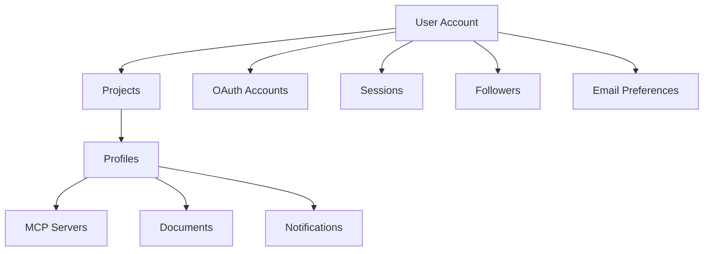

# User Management

Comprehensive guide to user account management, data deletion cascade, and GDPR compliance in Plugged.in.

## Overview

<Info>
Plugged.in is a trademark of VeriTeknik B.V. in the Netherlands and fully complies with GDPR regulations.
</Info>

The platform provides:
- Complete user account management
- GDPR-compliant data deletion
- Cascading deletion of all related data
- Audit trail for compliance
- User data export functionality

## User Account Structure

### Data Hierarchy



### User Data Categories

<CardGroup cols={2}>
  <Card title="Core Data" icon="user">
    - User profile (name, email, bio)
    - Authentication credentials
    - Projects and profiles
    - Sessions and tokens
  </Card>
  <Card title="Generated Content" icon="file">
    - MCP server configurations
    - Documents and RAG data
    - Collections and shares
    - Activity logs
  </Card>
  <Card title="Social Features" icon="users">
    - Follower relationships
    - Shared servers
    - Public profiles
    - User ratings
  </Card>
  <Card title="Preferences" icon="gear">
    - Email settings
    - Notification preferences
    - UI customizations
    - API keys
  </Card>
</CardGroup>

## GDPR Compliance

### Right to be Forgotten

<Badge variant="success">✅ Fully GDPR Compliant</Badge>

When a user account is deleted, ALL related data is permanently removed:

<Steps>
  <Step title="User Request">
    User initiates account deletion from settings
  </Step>
  <Step title="Confirmation">
    Email confirmation sent to verify identity
  </Step>
  <Step title="Data Deletion">
    Complete cascade deletion of all user data
  </Step>
  <Step title="Audit Log">
    Deletion logged for compliance records
  </Step>
  <Step title="Notification">
    Admin notified of GDPR deletion
  </Step>
</Steps>

### Data Deletion Cascade

Complete list of data deleted with user account:

#### Core User Data
| Table | Description | Deletion Method |
|-------|-------------|-----------------|
| `accounts` | OAuth provider accounts | CASCADE |
| `sessions` | Active login sessions | CASCADE |
| `password_reset_tokens` | Password reset tokens | CASCADE |
| `projects` | All user projects | CASCADE |
| `profiles` | All profiles | CASCADE via projects |

#### MCP Server Data
| Table | Description | Deletion Method |
|-------|-------------|-----------------|
| `mcp_servers` | Server configurations | CASCADE via profiles |
| `mcp_server_tools` | Server tools | CASCADE |
| `mcp_server_prompts` | Server prompts | CASCADE |
| `mcp_server_resources` | Server resources | CASCADE |
| `mcp_server_environment_variables` | Environment variables | CASCADE |
| `custom_instructions` | Custom instructions | CASCADE |

#### Document & RAG Data
| Table | Description | Deletion Method |
|-------|-------------|-----------------|
| `docs` | Uploaded documents | CASCADE |
| `doc_chunks` | Document chunks | CASCADE via docs |
| `doc_embeddings` | Document embeddings | CASCADE via docs |
| `document_versions` | Version history | CASCADE |
| `document_model_attributions` | AI attributions | CASCADE |

#### Social Features
| Table | Description | Deletion Method |
|-------|-------------|-----------------|
| `followers` | Follower relationships | CASCADE |
| `shared_mcp_servers` | Shared servers | CASCADE |
| `shared_collections` | Shared collections | CASCADE |
| `mcp_activity` | Activity logs | CASCADE |
| `notifications` | User notifications | CASCADE |

#### Email & Preferences
| Table | Description | Deletion Method |
|-------|-------------|-----------------|
| `email_tracking` | Email tracking data | CASCADE |
| `user_email_preferences` | Email preferences | CASCADE |
| `scheduled_emails` | Scheduled emails | CASCADE |

#### Registry Data
| Table | Description | Deletion Method |
|-------|-------------|-----------------|
| `registry_oauth_sessions` | OAuth sessions | CASCADE |
| `registry_user_ratings` | User ratings | CASCADE |
| `registry_servers` | Claimed servers | CASCADE |

## Account Deletion Process

### User-Initiated Deletion

<Warning>
Account deletion is permanent and cannot be undone. All data will be lost.
</Warning>

```typescript
// Account deletion endpoint
POST /api/settings/account/delete

// Request body
{
  "password": "current_password",
  "confirmation": "DELETE MY ACCOUNT"
}

// Process
1. Verify user password
2. Check confirmation text
3. Log deletion request
4. Delete user avatar files
5. Execute CASCADE deletion
6. Send admin notification
7. Clear all sessions
```

### Admin-Initiated Deletion

For GDPR requests or violations:

```typescript
// Admin deletion endpoint
DELETE /api/admin/users/{userId}

// Headers
{
  "Authorization": "Bearer ADMIN_TOKEN",
  "X-Admin-Secret": "ADMIN_SECRET",
  "X-Deletion-Reason": "GDPR request | TOS violation | User request"
}

// Audit log entry
{
  "action": "admin_user_deletion",
  "admin_id": "admin_123",
  "user_id": "user_456",
  "reason": "GDPR request",
  "timestamp": "2025-01-28T10:00:00Z",
  "ip_address": "192.168.1.1"
}
```

## Data Export

### User Data Export

Users can export their data before deletion:

```typescript
GET /api/settings/account/export

// Response: ZIP file containing
- user_profile.json
- projects.json
- mcp_servers.json
- documents/
- activity_log.csv
- followers.json
- email_preferences.json
```

### Export Format

```json
{
  "export_version": "1.0",
  "export_date": "2025-01-28T10:00:00Z",
  "user": {
    "id": "user_123",
    "email": "user@example.com",
    "name": "John Doe",
    "created_at": "2024-01-01T00:00:00Z"
  },
  "projects": [...],
  "servers": [...],
  "documents": [...],
  "activity": [...]
}
```

## User Management API

### Get User Profile

```typescript
GET /api/users/{userId}

Response:
{
  "id": "user_123",
  "username": "johndoe",
  "name": "John Doe",
  "email": "john@example.com",
  "bio": "Software developer",
  "avatar_url": "/avatars/user_123.png",
  "is_public": true,
  "created_at": "2024-01-01T00:00:00Z"
}
```

### Update User Profile

```typescript
PATCH /api/users/{userId}

Request:
{
  "name": "Jane Doe",
  "bio": "Full-stack developer",
  "is_public": false
}
```

### Manage Email Preferences

```typescript
PUT /api/users/{userId}/email-preferences

Request:
{
  "notifications": true,
  "newsletter": false,
  "security_alerts": true,
  "activity_digest": "weekly"
}
```

## Privacy Controls

### Profile Visibility

Users can control their profile visibility:

```typescript
// Profile visibility settings
{
  "is_public": boolean,        // Public profile accessible at /to/username
  "show_email": boolean,        // Display email on profile
  "show_activity": boolean,     // Show recent activity
  "show_followers": boolean,    // Display follower count
  "allow_following": boolean    // Allow others to follow
}
```

### Data Sharing Controls

```typescript
// Sharing preferences
{
  "default_visibility": "private" | "workspace" | "public",
  "allow_server_cloning": boolean,
  "allow_collection_forking": boolean,
  "share_usage_analytics": boolean
}
```

## Audit & Compliance

### Audit Trail

All user management actions are logged:

```typescript
interface AuditLog {
  id: string;
  action: 'user_created' | 'user_updated' | 'user_deleted';
  user_id: string;
  admin_id?: string;
  changes?: Record<string, any>;
  ip_address: string;
  user_agent: string;
  timestamp: Date;
  gdpr_compliant: boolean;
}
```

### Compliance Reports

Generate GDPR compliance reports:

```typescript
GET /api/admin/compliance/report

Response:
{
  "period": "2025-01",
  "deletions": {
    "total": 15,
    "gdpr_requests": 5,
    "user_initiated": 10
  },
  "exports": {
    "total": 45,
    "completed": 45,
    "failed": 0
  },
  "data_categories_deleted": [
    "personal_data",
    "usage_data",
    "content_data"
  ]
}
```

## Testing User Deletion

### Deletion Checklist

<Checklist>
- [ ] All projects deleted
- [ ] All profiles deleted
- [ ] All MCP servers deleted
- [ ] All documents deleted
- [ ] All notifications deleted
- [ ] Email tracking deleted
- [ ] Follower relationships removed
- [ ] OAuth accounts removed
- [ ] Sessions terminated
- [ ] Claimed servers handled
- [ ] Avatar files deleted
- [ ] Audit log created
- [ ] Admin notified
</Checklist>

### Test Script

```bash
# Test user deletion cascade
npm run test:gdpr-deletion

# Verify no orphaned data
SELECT * FROM projects WHERE user_id = 'deleted_user_id';
SELECT * FROM mcp_servers WHERE profile_uuid IN
  (SELECT uuid FROM profiles WHERE project_uuid IN
    (SELECT uuid FROM projects WHERE user_id = 'deleted_user_id'));
```

## Security Considerations

### Authentication Requirements

- Password verification for deletion
- Email confirmation for sensitive changes
- Session invalidation after deletion
- Rate limiting on deletion requests

### Data Retention

<Info>
Deleted data is permanently removed and cannot be recovered.
</Info>

- No soft deletes for user data
- Immediate deletion from database
- File system cleanup for avatars
- Cache invalidation across all services

## Best Practices

<AccordionGroup>
  <Accordion title="Regular Data Audits">
    Periodically audit user data to ensure compliance
  </Accordion>
  <Accordion title="Clear Communication">
    Inform users about data deletion consequences
  </Accordion>
  <Accordion title="Export Before Delete">
    Encourage users to export data before deletion
  </Accordion>
  <Accordion title="Audit Trail Maintenance">
    Keep detailed logs of all deletions for compliance
  </Accordion>
  <Accordion title="Test Cascade Deletions">
    Regularly test that all related data is deleted
  </Accordion>
</AccordionGroup>

## Support

For user management assistance:
- **Privacy Policy**: [plugged.in/privacy](https://plugged.in/privacy)
- **Support Email**: privacy@plugged.in
- **GDPR Requests**: gdpr@plugged.in
- **Documentation**: [docs.plugged.in](https://docs.plugged.in)