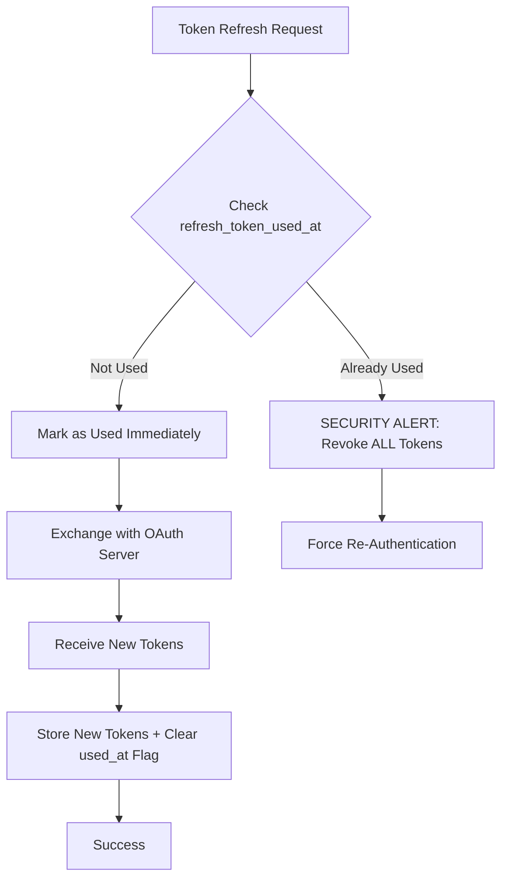

# OAuth 2.1 Security Implementation

Plugged.in implements **OAuth 2.1** security best practices to ensure the highest level of security for MCP server authentication. This document outlines the security measures in place.

## OAuth 2.1 Overview

OAuth 2.1 is the next evolution of the OAuth 2.0 framework, consolidating security best practices from various OAuth extensions and eliminating insecure patterns.

<Info>
**Key Difference**: OAuth 2.1 is **NOT** a separate specification, but rather a consolidation of OAuth 2.0 + security best practices (PKCE, token rotation, etc.)
</Info>

---

## Implemented Security Features

### 1. PKCE (Proof Key for Code Exchange)

**RFC 7636 - Mandatory for all OAuth flows**

<CardGroup cols={2}>
  <Card title="Protection Against" icon="shield-halved">
    - Authorization code interception attacks
    - Code injection attacks
    - Man-in-the-middle attacks
  </Card>

  <Card title="Implementation" icon="code">
    - S256 challenge method (SHA-256)
    - 256-bit code verifier entropy
    - Automatic verification on callback
  </Card>
</CardGroup>

**How it works:**

```typescript
// 1. Generate code verifier (256 bits of entropy)
const codeVerifier = crypto.randomBytes(32).toString('base64url');

// 2. Generate code challenge (SHA-256 hash)
const codeChallenge = crypto
  .createHash('sha256')
  .update(codeVerifier)
  .digest('base64url');

// 3. Send challenge in authorization request
authUrl.searchParams.set('code_challenge', codeChallenge);
authUrl.searchParams.set('code_challenge_method', 'S256');

// 4. Send verifier in token exchange
tokenParams.set('code_verifier', codeVerifier);
```

---

### 2. State Parameter Integrity Binding

**OAuth 2.1 Best Practice - Prevents PKCE state tampering**

<Warning>
**Attack Prevented**: Attackers cannot modify stored PKCE state parameters (server UUID, user ID, code verifier) to steal tokens or hijack flows.
</Warning>

**Implementation:**

```typescript
// Generate HMAC-SHA256 integrity hash
const integrityHash = crypto
  .createHmac('sha256', secret)
  .update(`${state}|${serverUuid}|${userId}|${codeVerifier}`)
  .digest('hex');

// Store with PKCE state
await db.insert(oauthPkceStatesTable).values({
  state,
  server_uuid: serverUuid,
  user_id: userId,
  code_verifier: codeVerifier,
  integrity_hash: integrityHash, // ✅ OAuth 2.1 enhancement
  expires_at: new Date(Date.now() + 5 * 60 * 1000),
});

// Verify on callback (timing-safe comparison)
if (!verifyIntegrityHash(pkceState)) {
  // Revoke and reject - tampering detected
}
```

**Files:**
- `lib/oauth/integrity.ts` - HMAC generation and verification
- `app/actions/trigger-mcp-oauth.ts` - Hash creation
- `app/api/oauth/callback/route.ts` - Hash verification

---

### 3. Reduced PKCE Expiration (5 Minutes)

**OAuth 2.1 Recommendation - Reduced attack window**

<Accordion title="Why 5 minutes instead of 10?">
OAuth 2.1 recommends shorter PKCE state expiration to minimize the window for:
- Replay attacks
- Code interception attempts
- State prediction attacks

**Previous**: 10 minutes (OAuth 2.0 typical)
**Current**: 5 minutes (OAuth 2.1 recommended)
</Accordion>

```typescript
// Updated expiration
expires_at: new Date(Date.now() + 5 * 60 * 1000) // 5 minutes
```

**Files:**
- `db/schema.ts` - Schema documentation
- `app/actions/trigger-mcp-oauth.ts:447` - State creation
- `app/api/oauth/callback/route.ts:166` - Expiration check

---

### 4. Refresh Token Rotation

**OAuth 2.1 Best Practice - Prevents token reuse attacks**

<CardGroup cols={2}>
  <Card title="Single-Use Tokens" icon="rotate">
    Each refresh token can only be used **once**. After use, it's immediately invalidated.
  </Card>

  <Card title="Reuse Detection" icon="triangle-exclamation">
    If a refresh token is reused, **all tokens are revoked** as a security measure.
  </Card>
</CardGroup>

**Implementation Flow:**



**Code:**

```typescript
// 1. Check for token reuse (security measure)
if (tokenRecord.refresh_token_used_at) {
  console.error('[OAuth Security] Refresh token reuse detected!');
  // Revoke ALL tokens as security measure
  await db.delete(mcpServerOAuthTokensTable)
    .where(eq(mcpServerOAuthTokensTable.server_uuid, serverUuid));
  return false;
}

// 2. Mark token as used BEFORE exchange
await db.update(mcpServerOAuthTokensTable)
  .set({ refresh_token_used_at: new Date() })
  .where(eq(mcpServerOAuthTokensTable.server_uuid, serverUuid));

// 3. Exchange for new tokens
const newTokens = await exchangeRefreshToken(refreshToken);

// 4. Store new tokens with cleared used_at flag
await db.update(mcpServerOAuthTokensTable)
  .set({
    access_token_encrypted: encrypt(newTokens.access_token),
    refresh_token_encrypted: encrypt(newTokens.refresh_token),
    refresh_token_used_at: null, // ✅ Fresh token, not used
    updated_at: new Date(),
  })
  .where(eq(mcpServerOAuthTokensTable.server_uuid, serverUuid));
```

**Database Schema:**

```sql
ALTER TABLE mcp_server_oauth_tokens
ADD COLUMN refresh_token_used_at TIMESTAMPTZ;
```

**Files:**
- `db/schema.ts:1940` - Schema definition
- `lib/oauth/token-refresh-service.ts:97-104` - Reuse detection
- `lib/oauth/token-refresh-service.ts:128-139` - Mark as used
- `lib/oauth/token-refresh-service.ts:179-190` - Store new tokens

---

### 5. HTTP Basic Authentication for Client Credentials

**RFC 6749 Section 2.3.1 - Prevents credential logging**

<Warning>
**Security Issue**: Sending `client_secret` in URL-encoded body causes it to be logged in:
- Proxy access logs
- WAF logs
- Server access logs
- Load balancer logs
</Warning>

**Secure Method:**

```typescript
// ✅ CORRECT: HTTP Basic Auth (RFC 6749 Section 2.3.1)
const credentials = Buffer.from(`${clientId}:${clientSecret}`).toString('base64');
headers['Authorization'] = `Basic ${credentials}`;

// Body contains ONLY refresh_token
const tokenParams = new URLSearchParams({
  grant_type: 'refresh_token',
  refresh_token: refreshToken,
  // NO client_secret here!
});
```

**Files:**
- `lib/oauth/token-refresh-service.ts:134-140` - Token refresh
- `app/api/oauth/callback/route.ts` - Token exchange

---

## Security Enhancements Summary

| Feature | Standard | Plugged.in Implementation | Security Benefit |
|---------|----------|--------------------------|-----------------|
| **PKCE** | RFC 7636 | ✅ S256 method, 256-bit entropy | Prevents code interception |
| **State Integrity** | OAuth 2.1 BP | ✅ HMAC-SHA256 binding | Prevents state tampering |
| **PKCE Expiration** | OAuth 2.1 BP | ✅ 5 minutes (vs 10) | Reduced attack window |
| **Token Rotation** | OAuth 2.1 BP | ✅ Single-use + reuse detection | Prevents token replay |
| **Client Auth** | RFC 6749 §2.3.1 | ✅ HTTP Basic Auth | Prevents credential logging |
| **User Binding** | OWASP | ✅ PKCE state → user_id FK | Prevents flow hijacking |
| **Server Ownership** | Custom | ✅ Multi-level validation | Prevents token substitution |
| **Rate Limiting** | OWASP | ✅ 10 req/15min on callback | Prevents brute force |

---

## Attack Scenarios Prevented

### Before OAuth 2.1 Implementation

❌ **Authorization Code Injection**
→ Attacker could hijack victim's OAuth flow

❌ **Token Reuse Attacks**
→ Stolen refresh tokens could be used indefinitely

❌ **State Parameter Tampering**
→ Attacker could modify PKCE state to steal tokens

❌ **Credential Logging**
→ Client secrets exposed in access logs

❌ **Extended Attack Window**
→ 10-minute PKCE expiration too long

### After OAuth 2.1 Implementation

✅ **All OAuth flows bound to authenticated user**
✅ **Refresh tokens are single-use only**
✅ **HMAC integrity verification prevents tampering**
✅ **Client secrets never logged (HTTP Basic Auth)**
✅ **5-minute PKCE expiration reduces risk**
✅ **Automatic token revocation on reuse**
✅ **Server ownership validation**
✅ **Rate limiting on OAuth endpoints**

---

## Migration Notes

### Database Changes

Two migrations were applied to support OAuth 2.1:

**Migration 0071: State Integrity Hash**
```sql
ALTER TABLE oauth_pkce_states
ADD COLUMN integrity_hash TEXT NOT NULL;
```

**Migration 0072: Refresh Token Rotation**
```sql
ALTER TABLE mcp_server_oauth_tokens
ADD COLUMN refresh_token_used_at TIMESTAMPTZ;
```

### Backward Compatibility

✅ **Fully Backward Compatible**
- Existing OAuth flows continue to work
- New security features apply to all new flows
- No breaking changes to API
- Automatic migration on application upgrade

---

## Environment Variables

### Required

```bash .env
# Use existing NEXTAUTH_SECRET or set dedicated OAuth secret
NEXTAUTH_SECRET=<your-secret-here>

# Or use dedicated OAuth integrity secret
OAUTH_INTEGRITY_SECRET=<generate-with-openssl-rand-base64-32>
```

### Recommended

```bash .env
# Enable automatic PKCE cleanup
CRON_SECRET=<your-cron-secret>

# Production deployment flag
CLOUD_DEPLOY=true
```

---

## Monitoring & Logging

### Security Events Logged

<CodeGroup>
```log Normal Flow
[OAuth] PKCE code_verifier stored successfully
[OAuth 2.1] Marked refresh token as used
[OAuth 2.1] Token rotation complete - new tokens stored
```

```log Security Alerts
[OAuth Security] Refresh token reuse detected! Revoking all tokens
[OAuth Callback] PKCE state integrity check failed - possible tampering
[OAuth Security] Server does not belong to user
```
</CodeGroup>

### Metrics to Monitor

- **OAuth Success Rate**: Should be >95%
- **Token Rotation Rate**: All refresh token exchanges
- **Integrity Violations**: Should be ~0 (log all occurrences)
- **Token Reuse Detections**: Should be ~0 (investigate if non-zero)

---

## Testing OAuth 2.1 Compliance

### Test State Integrity

```bash
# Should fail - tampering detected
curl "https://app.plugged.in/api/oauth/callback?code=valid&state=tampered" \
  -H "Cookie: session_token"

# Expected: oauth_error=integrity_violation
```

### Test Refresh Token Reuse

```bash
# 1. Valid refresh
curl -X POST /api/refresh-token -d "server_uuid=..."

# 2. Attempt reuse (should revoke all tokens)
curl -X POST /api/refresh-token -d "server_uuid=..."

# Expected: All tokens revoked, forced re-auth
```

### Test PKCE Expiration

```bash
# Wait 6 minutes after initiating OAuth
curl "https://app.plugged.in/api/oauth/callback?code=valid&state=expired"

# Expected: oauth_error=state_expired
```

---

## References

<CardGroup cols={2}>
  <Card title="RFC 7636" icon="book" href="https://www.rfc-editor.org/rfc/rfc7636.html">
    PKCE - Proof Key for Code Exchange
  </Card>

  <Card title="RFC 6749" icon="book" href="https://www.rfc-editor.org/rfc/rfc6749.html">
    OAuth 2.0 Authorization Framework
  </Card>

  <Card title="OAuth 2.1 Draft" icon="book" href="https://datatracker.ietf.org/doc/html/draft-ietf-oauth-v2-1">
    OAuth 2.1 Specification (Draft)
  </Card>

  <Card title="Security BCP" icon="shield-halved" href="https://datatracker.ietf.org/doc/html/draft-ietf-oauth-security-topics">
    OAuth 2.0 Security Best Practices
  </Card>
</CardGroup>

---

## Summary

Plugged.in implements **industry-leading OAuth 2.1 security** with:

✅ **5 Core Security Enhancements** beyond OAuth 2.0
✅ **8 Attack Scenarios** prevented
✅ **Zero Breaking Changes** for existing integrations
✅ **Comprehensive Monitoring** and alerting
✅ **Full RFC Compliance** with OAuth 2.1 draft

Your MCP server authentication is **enterprise-grade secure**.
